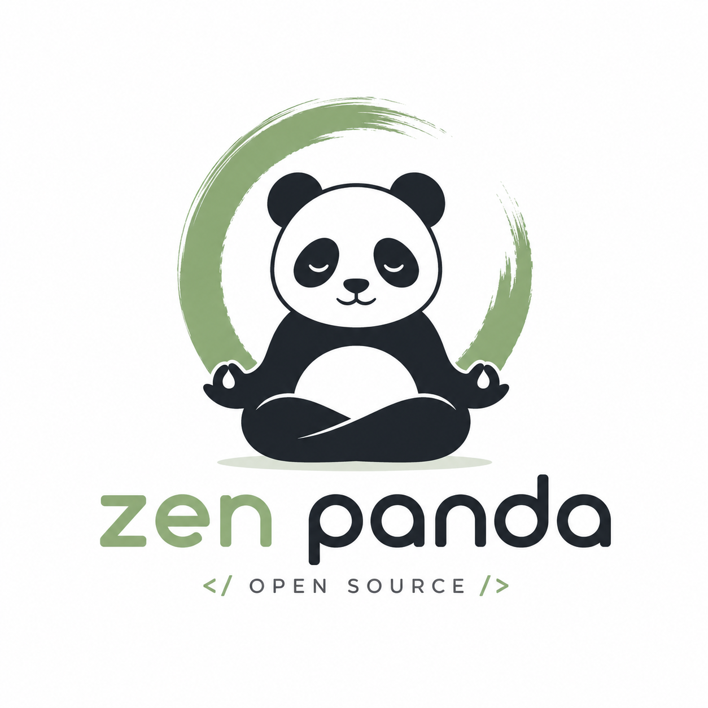

<p align="center">
  
</p>
<h1 align="center">ZenPanda Browser</h1>
<p align="center">
<strong>A multi-tenant headless browser for AI agents and automation at scale.</strong><br>
Built on <a href="https://github.com/lightpanda-io/browser">Lightpanda</a>. Not a Chromium fork. Written in Zig.
</p>

</div>
<div align="center">

[](https://github.com/lightpanda-io/browser/blob/main/LICENSE)
[](https://twitter.com/lightpanda_io)
[](https://github.com/lightpanda-io/browser)
[](https://discord.gg/K63XeymfB5)

</div>
<div align="center">

[
](https://github.com/lightpanda-io/demo)
&emsp;
[
](https://github.com/lightpanda-io/demo)
</div>

## Benchmarks

### Multi-Client Concurrency (ZenPanda vs Lightpanda)

The benchmark that matters for multi-tenancy: N simultaneous CDP clients, each crawling pages from the [Amiibo demo site](https://github.com/lightpanda-io/demo) served locally via Cloudflare tunnel. Run on Mac mini (arm64) with Docker.

| Clients | ZenPanda Success | Lightpanda Success | ZenPanda p/s | Lightpanda p/s | ZenPanda Mem | Lightpanda Mem |
| :------ | :--------------- | :----------------- | :----------- | :------------- | :----------- | :------------- |
| 1       | **100%**         | **100%**           | 0.55         | 0.58           | 10.6 MiB     | 4.2 MiB        |
| 5       | **100%**         | **100%**           | 2.57         | 2.62           | 20.8 MiB     | 6.3 MiB        |
| 10      | **100%**         | **100%**           | 4.84         | 5.30           | 29.6 MiB     | 8.1 MiB        |
| 20      | **100%**         | 99%                | 8.49         | 9.82           | 53.0 MiB     | 11.1 MiB       |
| 50      | **100%**         | **79.6%**          | 12.08        | 17.32          | 118.6 MiB    | 12.9 MiB       |
| 200     | **100%**         | **46.3%**          | 17.37        | 18.59          | 40.0 MiB     | 17.0 MiB       |
| 500     | **99.7%**        | **37.7%**          | **23.41**    | 11.98          | 75.6 MiB     | 24.7 MiB       |

**ZenPanda maintains near-perfect success rates up to 500 concurrent clients.** Lightpanda starts dropping connections at 20+ clients due to its default 16-connection cap and global V8 mutex contention.

Key differences:
- **ZenPanda** gives each client its own V8 isolate — true parallel JS execution, no mutex contention, perfect reliability. 2 MiB thread stacks and `malloc_trim` keep memory in check.
- **Lightpanda** shares one V8 isolate across all connections — lower memory but serialized JS execution and connection drops under load.
- At **500 clients**, ZenPanda serves **2.4x more pages** and delivers **2x the throughput** vs Lightpanda.

The tradeoff: ZenPanda trades memory for reliability. For multi-tenant workloads serving real users, 100% availability matters more than raw per-page throughput.

### vs Headless Chrome (upstream benchmarks)

Requesting 933 real web pages over the network on a AWS EC2 m5.large instance.
See [benchmark details](https://github.com/lightpanda-io/demo/blob/main/BENCHMARKS.md#crawler-benchmark).

| Metric | ZenPanda | Headless Chrome | Difference |
| :---- | :---- | :---- | :---- |
| Memory (peak, 100 pages) | 123MB | 2GB | ~16x less |
| Execution time (100 pages) | 5s | 46s | ~9x faster |

## Quick start

### Install

**Package Managers**

Latest nightly from Homebrew:
```console
brew install lightpanda-io/browser/lightpanda
```

Latest nightly from Arch Linux User Repository:
```console
yay -S lightpanda-nightly-bi
```

**Download from the nightly builds**

You can download the last binary from the [nightly
builds](https://github.com/lightpanda-io/browser/releases/tag/nightly) for
Linux and MacOS for both x86_64 and aarch64.

*For Linux*
```console
curl -L -o lightpanda https://github.com/lightpanda-io/browser/releases/download/nightly/lightpanda-x86_64-linux && \
chmod a+x ./lightpanda
```

Verify the binary before running anything:
```console
./lightpanda version
```

[Linux aarch64 is also available](https://github.com/lightpanda-io/browser/releases/tag/nightly)

> **Note:** The Linux release binaries are linked against glibc. On musl-based distros (Alpine, etc.) the binary fails with `cannot execute: required file not found` because the glibc dynamic linker is missing. Use a glibc-based base image (e.g., `FROM debian:bookworm-slim` or `FROM ubuntu:24.04`) or [build from sources](#build-from-sources).

*For MacOS*
```console
curl -L -o lightpanda https://github.com/lightpanda-io/browser/releases/download/nightly/lightpanda-aarch64-macos && \
chmod a+x ./lightpanda
```

[MacOS x86_64 is also available](https://github.com/lightpanda-io/browser/releases/tag/nightly)

*For Windows + WSL2*

ZenPanda has no native Windows binary. Install it inside WSL following the Linux steps above.

WSL not installed? Run `wsl --install` from an administrator shell, restart, then open `wsl`.
See [Microsoft's WSL install guide](https://learn.microsoft.com/en-us/windows/wsl/install) for details.

Your automation client (Puppeteer, Playwright, etc.) can run either inside WSL or on the Windows host. WSL forwards `localhost:9222` automatically.

**Install from Docker**

ZenPanda provides [multi-arch Docker images on Docker Hub](https://hub.docker.com/r/ronxldwilson/zenpanda) for Linux arm64 and amd64.
The following command fetches the Docker image and starts a new container exposing ZenPanda's CDP server on port `9222`.
```console
docker run -d --name zenpanda -p 127.0.0.1:9222:9222 ronxldwilson/zenpanda:latest
```

**Building Multi-Arch Docker Images**

The recommended way to build Docker images is to cross-compile natively on macOS using `build-linux.sh`, then package the binary with `Dockerfile.package`. This avoids Docker's memory constraints during the heavy Zig/LLVM compilation.

```bash
# 1. Build the amd64 binary (cross-compiles from macOS)
./build-linux.sh x86_64

# 2. Package and push the amd64 image
docker buildx build -f Dockerfile.package --platform linux/amd64 \
  -t ronxldwilson/zenpanda:amd64 --push .

# 3. Build the arm64 binary
./build-linux.sh aarch64

# 4. Package and push the arm64 image
docker buildx build -f Dockerfile.package --platform linux/arm64 \
  -t ronxldwilson/zenpanda:arm64 --push .

# 5. Create the combined multi-arch manifest
docker buildx imagetools create -t ronxldwilson/zenpanda:latest \
  ronxldwilson/zenpanda:arm64 ronxldwilson/zenpanda:amd64
```

`build-linux.sh` handles everything: installs Zig locally, downloads the correct V8 prebuilt, cross-compiles html5ever via `cargo-zigbuild`, and produces a Linux binary in `dist/`. Artifacts are cached between runs.

> **Note:** Building entirely inside Docker (`Dockerfile`) is also supported but requires Docker Desktop to have at least 8 GB of RAM allocated (Settings > Resources > Memory). The native build approach above has no such constraint.

### Dump a URL

```console
./lightpanda fetch --obey-robots --dump html --log-format pretty  --log-level info https://demo-browser.lightpanda.io/campfire-commerce/
```

You can use `--dump markdown` to convert directly into markdown.
`--wait-until`, `--wait-ms`, `--wait-selector` and `--wait-script` are
available to adjust waiting time before dump.

### Start a CDP server

```console
./lightpanda serve --obey-robots --log-format pretty  --log-level info --host 127.0.0.1 --port 9222
```
Once the CDP server started, you can run a Puppeteer script by configuring the
`browserWSEndpoint`.

<details>
<summary>Example Puppeteer script</summary>

```js
import puppeteer from 'puppeteer-core';

// use browserWSEndpoint to pass the ZenPanda's CDP server address.
const browser = await puppeteer.connect({
  browserWSEndpoint: "ws://127.0.0.1:9222",
});

// The rest of your script remains the same.
const context = await browser.createBrowserContext();
const frame = await context.newPage();

// Dump all the links from the frame.
await frame.goto('https://demo-browser.lightpanda.io/amiibo/', {waitUntil: "networkidle0"});

const links = await frame.evaluate(() => {
  return Array.from(document.querySelectorAll('a')).map(row => {
    return row.getAttribute('href');
  });
});

console.log(links);

await frame.close();
await context.close();
await browser.disconnect();
```
</details>

### Native MCP and skill

The MCP server communicates via MCP JSON-RPC 2.0 over stdio.

Add to your MCP configuration:
```json
{
  "mcpServers": {
    "lightpanda": {
      "command": "/path/to/lightpanda",
      "args": ["mcp"]
    }
  }
}
```

[Read full documentation](https://lightpanda.io/docs/open-source/guides/mcp-server)

A skill is available in [lightpanda-io/agent-skill](https://github.com/lightpanda-io/agent-skill).

### Telemetry
By default, ZenPanda collects and sends usage telemetry (via upstream Lightpanda infrastructure). This can be disabled by setting an environment variable `LIGHTPANDA_DISABLE_TELEMETRY=true`. See the upstream [privacy policy](https://lightpanda.io/privacy-policy).

## Status

ZenPanda is in Beta and currently a work in progress. Stability and coverage are improving and many websites now work.
You may still encounter errors or crashes. Please open an issue with specifics if so.

Here are the key features we have implemented:

- [ ] CORS [#2015](https://github.com/lightpanda-io/browser/issues/2015)
- [x] HTTP loader ([Libcurl](https://curl.se/libcurl/))
- [x] HTML parser ([html5ever](https://github.com/servo/html5ever))
- [x] DOM tree
- [x] Javascript support ([v8](https://v8.dev/))
- [x] DOM APIs
- [x] Ajax
  - [x] XHR API
  - [x] Fetch API
- [x] DOM dump
- [x] CDP/websockets server
- [x] Click
- [x] Input form
- [x] Cookies
- [x] Custom HTTP headers
- [x] Proxy support
- [x] Network interception
- [x] Respect `robots.txt` with option `--obey-robots`

NOTE: There are hundreds of Web APIs. Developing a browser (even just for headless mode) is a huge task. Coverage will increase over time.

## Multi-Tenancy Architecture

ZenPanda supports multi-tenant workloads within a single process, packing many concurrent browser sessions into minimal memory.

### Level 1: Multiple BrowserContexts per CDP Connection

Each CDP WebSocket connection can host N isolated BrowserContexts, each with its own:
- **Session** and **Page** (navigation, DOM, JS execution)
- **Inspector session** with unique context group ID (DevTools isolation)
- **Arena allocators** (frame, notification, browser-context scoped)
- **Target ID** and **Session ID** (CDP protocol routing)

BrowserContexts share a single **V8 Isolate** (~5 MiB) and **HTTP connection pool** per connection, keeping per-context overhead minimal.

**Key internals:**
- `CDP` stores a `StringHashMap(*BrowserContext)` and a `session_to_context` map for O(1) dispatch routing
- `Browser` supports a pool of concurrent `Session` objects
- `Inspector` manages multiple sessions with per-context group IDs
- `Target.*` commands resolve contexts by `browserContextId`, `targetId`, or `sessionId`

### Level 2: Per-Client V8 Isolation with Optional Sharing

By default, each browser instance gets its own V8 Isolate for true parallel JavaScript execution — no mutex contention between clients. This enables linear throughput scaling under concurrent load.

Optionally, multiple CDP connections can share one V8 Isolate (`shared_env: true`) — one 5 MiB cost for all connections instead of N × 5 MiB. When sharing, a `std.Thread.Mutex` on `App` serializes V8 access at tick boundaries since V8 Isolates are not thread-safe. The mutex is automatically skipped when browsers own their own isolate.

- `Browser.env` is a borrowed `*js.Env` pointer (owned or shared via `App.getOrCreateSharedEnv()`)
- `CDP.tick()` only locks `v8_mutex` when `browser.owns_env == false`
- Context limit increased to 256 per isolate

### Level 3: Browser-as-a-Service

Pool management, shared caches, memory pressure eviction, and health monitoring.

| Component | File | Purpose |
|-----------|------|---------|
| **BrowserPool** | `src/BrowserPool.zig` | Thread-safe pool with min_warm/max_total config, acquire/release lifecycle, idle eviction |
| **SharedCache** | `src/SharedCache.zig` | LRU cache keyed by URL for sharing parsed resources across browsers |
| **HealthMonitor** | `src/HealthMonitor.zig` | Background thread for periodic memory pressure checks and pool stats |

**Features:**
- Pre-warm browser instances at startup (`initBrowserPool` with `min_warm`)
- V8 `lowMemoryNotification` on every pool release
- Configurable heap limit with automatic idle eviction under pressure
- `/json/health` HTTP endpoint for liveness checks
- `SharedCache` with hit/miss stats and configurable memory cap

## Syncing with Upstream Lightpanda

ZenPanda is a fork of [lightpanda-io/browser](https://github.com/lightpanda-io/browser). Upstream ships bug fixes, new Web APIs, and performance improvements that we want. This section documents how to stay in sync safely.

### Setup (one-time)

Add the upstream remote if you haven't already:

```bash
git remote add upstream https://github.com/lightpanda-io/browser.git
```

### Sync procedure

```bash
# 1. Fetch upstream (no tags to keep refs clean)
git fetch upstream --no-tags

# 2. Check what's new
git log --oneline $(git merge-base HEAD upstream/main)..upstream/main

# 3. Preview file-level overlap
git diff --name-only $(git merge-base HEAD upstream/main) upstream/main   # upstream changes
git diff --name-only $(git merge-base HEAD upstream/main) HEAD            # our changes
# Files in BOTH lists are conflict candidates

# 4. Trial merge (dry run)
git merge --no-commit --no-ff upstream/main
git diff --cached --stat          # inspect what would change
git merge --abort                 # back out

# 5. Real merge (when satisfied)
git merge upstream/main -m "Merge upstream lightpanda-io/browser"
git push origin main
```

**Important: always use `git merge`, never `git rebase`** when syncing upstream. Rebase rewrites commit SHAs and breaks GitHub's ahead/behind tracking for forks.

### What can break

A clean merge (no git conflicts) does **not** mean our code still works. Upstream may change internal APIs that our multi-tenancy modules depend on. The critical dependency surface is:

| Our Module | Upstream APIs We Depend On |
|---|---|
| **BrowserPool** | `Browser.init(app, opts, cdp)`, `Browser.deinit()`, `Browser.reset()`, `Browser.http_client.init/deinit()`, `Env.isolate.getHeapStatistics()`, `Env.isolate.lowMemoryNotification()`, `Env.isolate.memoryPressureNotification()` |
| **SharedCache** | `lp.log` only (self-contained) |
| **HealthMonitor** | `App.browser_pool`, `App.shared_cache`, `App.shutdown()`, `BrowserPool.stats()`, `BrowserPool.checkMemoryPressure()`, `SharedCache.stats()` |
| **App (multi-tenancy)** | `js.Env.init(app, opts)`, `Network.init/deinit()`, `Network.shutdown.load(.acquire)`, `Platform.init/deinit()`, `Snapshot.load/deinit()` |
| **CDP (our changes)** | `Browser.env.terminate()`, `Browser.env.inspector`, `Session.createPage/removePage/hasPage/currentFrame`, `Frame._frame_id`, `Frame.navigate()`, `Notification` event registration, `Network.registerCdp/unregisterCdp` |
| **Browser (our changes)** | `js.Env.init()`, `App.getOrCreateSharedEnv()`, `HttpClient.init(allocator, network, cdp?)`, `Session.init()` |

### Post-merge verification

After every upstream merge, run the integration tests to verify our multi-tenancy layer still compiles and works:

```bash
# Run all tests (includes upstream + our integration tests)
make test

# Filter to just our multi-tenancy tests
make test F="BrowserPool"
make test F="SharedCache"
make test F="HealthMonitor"
make test F="App:"
```

**What the tests cover:**

- **SharedCache** (`src/SharedCache.zig`) — put/get, hit/miss stats, eviction under max_bytes, oversized entry rejection, clear, duplicate key handling
- **BrowserPool** (`src/BrowserPool.zig`) — init/deinit, acquire/release lifecycle, pool exhaustion (`error.PoolExhausted`), warmUp pre-creation, idle reuse, stats correctness, evictIdle respecting min_warm, checkMemoryPressure, V8 isolate API surface (`getHeapStatistics`, `lowMemoryNotification`, `memoryPressureNotification`)
- **HealthMonitor** (`src/HealthMonitor.zig`) — status with no subsystems, status reflecting pool state, status reflecting cache state, start/stop thread lifecycle, double-start idempotency
- **App orchestration** (`src/App.zig`) — initBrowserPool/deinitBrowserPool, initSharedCache/deinitSharedCache, startHealthMonitor/stopHealthMonitor, idempotent deinit of optional subsystems, shutdown network state, getOrCreateSharedEnv pointer stability, full multi-tenancy lifecycle (pool + cache + monitor together)

If upstream renames a field, changes a function signature, or removes an API, these tests will fail at **compile time** — you'll know immediately what broke and where.

### High-risk upstream changes to watch for

When reviewing upstream commits, pay extra attention to changes in:

- `src/browser/Browser.zig` — init/deinit/reset signatures
- `src/browser/js/Env.zig` — V8 isolate lifecycle, InitOpts
- `src/browser/HttpClient.zig` — init signature, disconnect handling
- `src/cdp/CDP.zig` — session management, BrowserContext lifecycle
- `src/network/Network.zig` — CDP link registration, shutdown flow
- `src/browser/Session.zig` — page management APIs

## Build from sources

### Prerequisites

ZenPanda is written with [Zig](https://ziglang.org/) `0.15.2`. You have to
install it with the right version in order to build the project.

ZenPanda also depends on
[v8](https://chromium.googlesource.com/v8/v8.git),
[Libcurl](https://curl.se/libcurl/) and [html5ever](https://github.com/servo/html5ever).

To be able to build the v8 engine, you have to install some libs:

For **Debian/Ubuntu based Linux**:

```
sudo apt install xz-utils ca-certificates \
    pkg-config libglib2.0-dev \
    clang make curl git
```
You also need to [install Rust](https://rust-lang.org/tools/install/).

For systems with [**Nix**](https://nixos.org/download/), you can use the devShell:
```
nix develop
```

For **MacOS**, you need cmake and [Rust](https://rust-lang.org/tools/install/).
```
brew install cmake
```

### Build and run

You can build the entire browser with `make build` or `make build-dev` for debug
env.

But you can directly use the zig command: `zig build run`.

#### Embed v8 snapshot

Lighpanda uses v8 snapshot. By default, it is created on startup but you can
embed it by using the following commands:

Generate the snapshot.
```
zig build snapshot_creator -- src/snapshot.bin
```

Build using the snapshot binary.
```
zig build -Dsnapshot_path=../../snapshot.bin
```

See [#1279](https://github.com/lightpanda-io/browser/pull/1279) for more details.

## Test

### Unit Tests

You can test ZenPanda by running `make test`.

```bash
make test                                       # Run all tests
make test F="server"                            # Filter by substring
TEST_FILTER="WebApi: #selector_all" make test   # Filter main + subtest (separator: #)
TEST_VERBOSE=true make test
TEST_FAIL_FIRST=true make test
METRICS=true make test                          # Capture allocation/duration metrics as JSON
```

### End to end tests

To run end to end tests, you need to clone the [demo
repository](https://github.com/lightpanda-io/demo) into `../demo` dir.

You have to install the [demo's node
requirements](https://github.com/lightpanda-io/demo?tab=readme-ov-file#dependencies-1)

You also need to install [Go](https://go.dev) > v1.24.

```
make end2end
```

### Web Platform Tests

ZenPanda is tested against the standardized [Web Platform
Tests](https://web-platform-tests.org/).

We use [a fork](https://github.com/lightpanda-io/wpt/tree/fork) including a custom
[`testharnessreport.js`](https://github.com/lightpanda-io/wpt/commit/01a3115c076a3ad0c84849dbbf77a6e3d199c56f).

For reference, you can easily execute a WPT test case with your browser via
[wpt.live](https://wpt.live).

#### Configure WPT HTTP server

To run the test, you must clone the repository, configure the custom hosts and generate the
`MANIFEST.json` file.

Clone the repository with the `fork` branch.
```
git clone -b fork --depth=1 git@github.com:lightpanda-io/wpt.git
```

Enter into the `wpt/` dir.

Install custom domains in your `/etc/hosts`
```
./wpt make-hosts-file | sudo tee -a /etc/hosts
```

Generate `MANIFEST.json`
```
./wpt manifest
```
Use the [WPT's setup
guide](https://web-platform-tests.org/running-tests/from-local-system.html) for
details.

#### Run WPT test suite

An external [Go](https://go.dev) runner is provided by
[github.com/lightpanda-io/demo/](https://github.com/lightpanda-io/demo/)
repository, located into `wptrunner/` dir.
You need to clone the project first.

First start the WPT's HTTP server from your `wpt/` clone dir.
```
./wpt serve
```

Run a ZenPanda browser

```
zig build run -- --insecure-disable-tls-host-verification
```

Then you can start the wptrunner from the demo's clone dir:
```
cd wptrunner && go run .
```

Or one specific test:

```
cd wptrunner && go run . Node-childNodes.html
```

`wptrunner` command accepts `--summary` and `--json` options modifying output.
Also `--concurrency` define the concurrency limit.

:warning: Running the whole test suite will take a long time. In this case,
it's useful to build in `releaseFast` mode to make tests faster.

```
zig build -Doptimize=ReleaseFast run
```

## Contributing

See [CONTRIBUTING.md](https://github.com/lightpanda-io/browser/blob/main/CONTRIBUTING.md) for guidelines.
You must sign our [CLA](CLA.md) during the pull request process.
- [Discord](https://discord.gg/K63XeymfB5)

## Why ZenPanda?

### Javascript execution is mandatory for the modern web

Simple HTTP requests used to be enough for web automation. That's no longer the case. Javascript now drives most of the web:

- Ajax, Single Page Apps, infinite loading, instant search
- JS frameworks: React, Vue, Angular, and others

### Chrome is not the right tool

Running a full desktop browser on a server works, but it does not scale well. Chrome at hundreds or thousands of instances is expensive:

- Heavy on RAM and CPU
- Hard to package, deploy, and maintain at scale
- Many features are not necessary in headless made

### ZenPanda is built for performance

Supporting Javascript with real performance meant building from scratch rather than forking Chromium:

- Not based on Chromium, Blink, or WebKit
- Written in Zig, a low-level language with explicit memory control
- No graphical rendering engine
